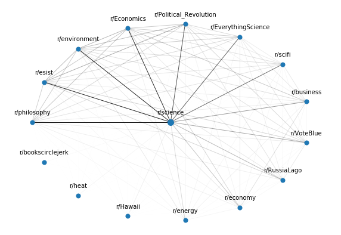

# Reddit-Recommendations
Analysis of Reddit likes data to generate recommendations.

## Outline

1. Goals
2. Data
    - Metrics
    - Histograms
3. Approach
    - Similar work
    - Naive
    - TF-IDF
    - Eigenvector Centrality
    - Results
4. Final Product

## 1. Goals

Develop and host a website where users can submit a query to find similar subreddits.

## 2. Data

Data available at kaggle.com [here](https://www.kaggle.com/josephleake/huge-collection-of-reddit-votes/).

### i. Metrics
A total of 44,863,247 unique votes are represented.
34,569,390 (77%) were upvotes.
10,293,857 (23%) were downvotes.
22,626,222 unique submissions voted on.
35,716 unique users are represented.
139,891 unique subreddits are represented.

### ii. Histograms

The following histogram shows how many subreddits have a set number of likes. Note that both plots have a log y-scale.

The next histogram shows how many subreddits have a set number of likes.

## 3. Approach

### i. Similar Work

Other websites to find similar subreddits:

[This website](https://anvaka.github.io/redsim/) and [this website](https://anvaka.github.io/sayit/?query=) both use Jaccard index to rank similarity based on user comments. Does not work well for very popular subreddits and overrides results for some larger subreddits.

[This website](https://subredditstats.com/subreddit-user-overlaps/) calculates the probability that a user of a subreddit will post or comment in another subreddit. No link to data source or methodology.

### ii. Naive

A simple approach follows the following algorithm:
1. Get the users of a subreddit.
2. Get all the likes from each of those users.
3. Count the number of likes for each subreddit

Example: Top 10 most like subreddits from users of 'r/science'

### iii. TF-IDF

#### Problem: Most popular subreddits of users of a specific subreddit are not necessarily similar.

Popular subreddits get attention from large numbers of users regardless of similarity.

To get similar subreddits, we need to filter popular subreddits among all users.

#### Solution: Use a modified TF-IDF weighting scheme to offset popular subreddits.
The TF value evaluates the number of likes of other subreddits, and the IDF value offsets the popularity of the subreddits amongst other users.

### iv. Eigenvector Centrality

#### Problem: Subreddits with small numbers of users with a large number of likes get ranked high regardless of similarity to other subreddits.

#### Solution: Form a network based on the number of shared users between subreddits and rank them based on eigenvector centrality.
The relevance of a subreddit should also be based on a network of shared users.

### v. Results

Search results of r/science.

Some results are clearly not relevant.

r/heat is the subreddit for the Miami Heat basketball team and not scientific concept of heat.

The eigenvector centrality ranks r/heat lower due to its irrelevance to the other results.

The following image shows the relationships between the top search results from the TF-IDF. Each node represents a subreddit and each edge is the number of users shared between the subreddits. The more shared users the darker the color.

Code used to generate results are available upon request.

## 5. Final Product

These are tasks that I would like to get done for the final product.
- Write website where users can submit queries.
- Generate links to subreddits.
- Find a server to calculate data and store results.
- Use server to gather new data to store.
- Generate visualization of networks on website.
